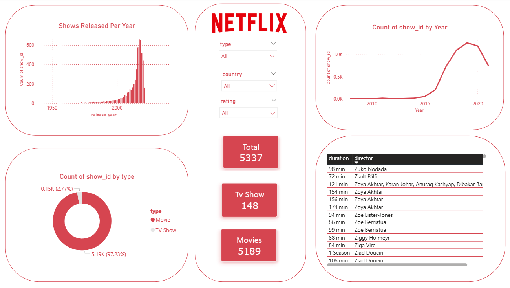

+# Netflix Content Dashboard - Power BI

## 📊 Project Overview
Interactive dashboard analyzing Netflix movies and TV shows data from 1950 to 2020.

## 🔍 Key Insights
- **Total Content**: 5337 titles
- **Movies**: 5189 (97.23%)
- **TV Shows**: 148 (2.77%)
- Peak content releases happened around 2018-2020

## 🛠️ Tools Used
- Power BI Desktop
- DAX for measures
- Data Visualization
## 📸 Dashboard Preview

## 📂 Files
- `Netflix.pbix` → Open with Power BI Desktop to explore interactively
- `Dashboard_Screenshot.png` → Dashboard preview
